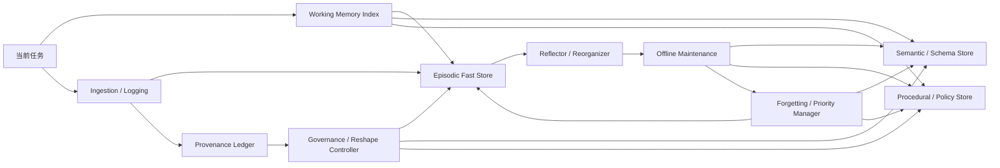

# MIND 设计拆解与前期实施指南

## 0. 这份文档的目标

这份文档不是论文，也不是功能清单。

它的目标只有一个：把 MIND 从“一个很强的想法”拆成“可以分阶段推进的系统设计与前期工作计划”。

文档会重点回答 5 个问题：

- MIND 到底在做什么
- 它和普通 memory / RAG 的根本区别是什么
- 这个系统的核心架构应该怎么理解
- 前期应该按什么顺序推进
- 每个阶段为什么必要、重点在哪、难点在哪、预计要投入多少精力

说明：

- 这里故意忽略了一些不重要或过早的细节
- 精力预估以“研究原型”为前提，不按生产级系统估算
- 默认团队规模按 1 名主力工程师 + 1 名设计/研究协作者 来理解

## 0.1 一页总览

| 问题 | MIND 的回答 |
| --- | --- |
| 这是什么 | 一个可演化的外部记忆环境，不只是记忆库 |
| 核心目标 | 在不改模型权重的前提下，让记忆随着任务持续变得更有用 |
| 和普通 RAG 的区别 | 不只检索，还允许写回、反思、重组、归档、离线整理 |
| 最关键结构 | `Working Memory Index + Episodic Store + Semantic Store + Procedural Store + Offline Maintenance Loop + Provenance / Governance Control Plane` |
| 前期最重要的事 | 先跑通“记录 -> 检索 -> 工作视图 -> 反思 -> 离线整理 -> 再利用”的闭环 |
| 第一版最容易做错的地方 | 一开始就做成复杂知识库，或者退化成复杂版 RAG |
| 最小验证目标 | 连续任务中，后续任务的成本或效果因记忆整理而改善 |

阅读建议：

- 第一次读：先看 `0.1 -> 5.4 -> 5.5 -> 8.1 -> 12`
- 要开设计会：重点看 `5.5 / 8.1 / 11`
- 要开始实现：重点看 `8 / 11 / 13`

---

## 1. 用一句话理解 MIND

MIND 要做的，不是一个“帮 LLM 查资料”的记忆库，而是一个“允许 LLM 持续经营、重组和优化自身外部记忆”的环境。

更直接一点说：

普通系统是在问“怎么把相关内容找回来”；
MIND 在问“怎么让记忆本身随着任务不断变得更有用”。

---

## 2. MIND 的核心主张

MIND 的核心主张可以压缩成四句话：

1. 模型权重会停止更新，但记忆不应该停止成长。
2. 不要过早把经验压缩成工程师预设好的结构。
3. 应该给模型一组基础记忆原语，而不是一条写死的记忆流程。
4. 记忆系统的好坏，要看它是否能在长期任务里持续提高收益并控制成本。

这意味着，MIND 真正关注的是“记忆演化”，不是“记忆存储”。

---

## 3. 它和普通 RAG / Memory 模块的区别

普通 RAG 的基本逻辑是：

- 切块
- 建索引
- 召回
- 拼接上下文

这类系统当然有价值，但它的重点是“检索是否命中”。

MIND 想解决的问题更进一步：

- 记忆可以新增
- 记忆可以摘要
- 记忆可以链接
- 记忆可以拆分、合并、降权、归档
- 记忆可以被反思和重组
- 这些结构变化会影响后续任务表现

所以，MIND 更像一个“外部可塑认知环境”，而不是一个“检索服务”。

如果这个区别不守住，项目最终很容易退化成“包装更复杂的 RAG”。

---

## 4. 系统应该怎样理解

## 4.1 一个更清晰的抽象

MIND 可以被理解为下面这个闭环：

`任务到来 -> 观察记忆世界 -> 检索和组织 -> 完成任务 -> 评估记忆是否有效 -> 写回经验与反思 -> 重组记忆结构 -> 服务后续任务`

这条闭环比任何单个模块都重要。

因为 MIND 的重点从来不是“某次召回做得多漂亮”，而是“系统有没有随着任务序列变得更会记、更会用、成本更低”。

补充约束：

- 上面这条闭环描述的是“成长路径”，不是“治理路径”
- 一旦系统需要按来源主体、时间窗或保留策略主动忘记和重塑，就必须引入独立的 `governance / reshape loop`
- provenance 应该作为 control plane 存在，而不是偷偷混进摘要、检索特征或普通 metadata

## 4.2 系统里真正要设计的对象

从工程角度看，MIND 不是一个对象，而是 5 个对象一起工作：

| 对象 | 它是什么 | 为什么重要 |
| --- | --- | --- |
| `Memory World` | 外部可编辑的记忆环境 | 给 Agent 一个可操作的外部认知空间 |
| `Memory Objects` | 系统里的基本记忆单位 | 决定记忆能否被追踪、引用、重组 |
| `Primitive Operations` | Agent 可执行的最小记忆动作 | 决定系统是“可操作”而不只是“可存储” |
| `Utility Objective` | 衡量记忆系统是否变好的统一目标 | 防止系统只会越存越多 |
| `Growth Loop` | 使用、反馈、写回、重组、再使用的闭环 | 决定系统能否真正成长 |

### 1. Memory World

外部记忆环境本身，里面包含：

- 原始经验
- 派生表示
- 对象关系
- 检索索引
- 状态和版本
- 成本与预算

### 2. Memory Objects

系统里的基本记忆单位，例如：

- 原始对话记录
- 工具调用轨迹
- 任务 episode
- 派生摘要
- 反思笔记
- 实体节点
- 关系边
- 当前任务工作视图

### 3. Primitive Operations

当前冻结的基础动作是：

- `write_raw`
- `read`
- `retrieve`
- `summarize`
- `link`
- `reflect`
- `reorganize_simple`

更细粒度的 `split / merge / archive / evaluate` 只保留为后续候选动作，不属于当前冻结的 primitive 集合。

### 4. Utility Objective

系统的统一目标：

在成本受限的条件下，最大化未来任务中的累计记忆效用。

### 5. Growth Loop

让系统真正发生成长的机制：

- 使用
- 反馈
- 写回
- 重组
- 再使用

没有这 5 个对象的完整闭环，MIND 就不成立。

## 4.3 一个重要补充：MIND 也应该吸收认知系统约束

MIND 不是要“模拟大脑”，但它非常适合借鉴生物记忆系统里那些已经被反复验证的约束和机制。

原因很简单：

- 人类记忆不是一个平铺的大仓库，而是分层、限速、分时处理的
- 有些记忆在线快速可用，有些记忆只能离线整理
- 有些记忆会变得稳定，有些记忆会衰退，有些记忆会被主动压制
- 记忆的重要性并不均匀，系统会优先处理弱但关键、或新颖且高价值的信息

这对 MIND 的启发很直接：

- MIND 不应只有一个统一 memory store
- MIND 不应只有在线检索，没有离线整理
- MIND 不应只考虑“如何记住”，也要考虑“如何不让噪声占满系统”
- MIND 不应把所有记忆对象看作同一种东西

下面的架构建议，会把这些认知约束真正落到系统设计里。

---

## 5. 架构设计：前期应该怎样搭

为了便于实现，建议把架构分成两层来理解：数据层和控制层。

## 5.1 数据层：记忆到底存成什么

建议坚持三层结构。

### 原始经验层

存最原始、最少加工的材料：

- 用户输入
- Agent 输出
- 工具调用和结果
- 任务目标
- 成败结果
- 时间顺序

这一层的价值是：

- 高保真
- 可回放
- 可追溯
- 不会因为早期建模错误把未来上限锁死

### 可塑表示层

存模型自己逐步构建出来的中间结构：

- 摘要
- 标签
- 关系图
- 实体
- 局部索引
- 任务经验
- 反思结果

这一层的价值是：

- 降低后续检索和推理成本
- 让系统可以逐步形成更好结构
- 给“重组”和“演化”提供抓手

### 工作视图层

存为当前任务临时构造出来的可执行记忆视图。

它不是长期知识库，而是当前任务的“记忆工作台”。

这一层的价值是：

- 控制 token 成本
- 把杂乱记忆压缩成当前任务可用的上下文
- 让系统有能力面向任务组织记忆，而不只是被动召回

### 来源与治理控制面

除 data plane 之外，还需要一条独立 control plane，至少保存：

- provenance ledger
- governance audit
- reshape plan / preview / approval / execution 记录

这一层的作用不是让模型“更会想”，而是让系统：

- 知道每条原始数据来自谁、什么环境、什么时间
- 支持高权限按来源规则主动忘记
- 支持对 mixed-source 派生对象做细粒度重写
- 把治理能力与记忆优化能力严格分开

实现注意点：

- `ip_addr / device_id / machine_fingerprint` 可以按治理要求明文存放
- 但它们必须被视为高敏控制面字段，而不是普通业务 metadata

## 5.2 控制层：谁在驱动记忆演化

控制层至少需要 8 个模块：

### 1. Ingestion / Logging

负责把原始交互和工具轨迹写入系统。

### 2. Primitive Engine

负责执行记忆原语，把 LLM 的操作请求落到数据层。

### 3. Retrieval + Workspace Builder

负责为当前任务检索候选记忆，并构造工作视图。

### 4. Evaluator

负责评估本次任务中哪些记忆真正有帮助，哪些操作值得保留。

### 5. Reorganizer / Reflector

负责在任务结束后写回反思，并对记忆结构做轻量重组。

### 6. Offline Maintenance

负责在“非当前任务时段”做离线记忆维护。

它的职责不是回答当前问题，而是：

- 重放近期 episode
- 强化高价值记忆
- 压缩弱但重要的经验
- 建立跨任务链接
- 生成更抽象的中间表示

### 7. Forgetting / Priority Manager

负责做优先级调整、降权、归档和可恢复抑制。

它的价值在于防止系统无限堆积，并让“记忆可用性”随着时间和反馈动态变化。

### 8. Governance / Reshape Controller

负责执行高权限、主动触发、可能较重的治理流程。

它的职责不是优化当前回答，也不是替代离线维护，而是：

- 按 provenance 条件筛选受影响原始记录
- 预览和审计治理影响范围
- 执行 `conceal / erase`
- 对 mixed-source 派生对象按最小治理粒度重写
- 清理索引、缓存、评测工件和外部副本

## 5.2.1 运行时访问深度不应只有一个固定档

如果 MIND 只有一种固定 retrieval / workspace 深度，它很快就会在两个方向上同时吃亏：

- 对简单对话太重，成本和时延不必要地升高
- 对高正确性任务太浅，覆盖和证据校验不足

因此，运行时访问策略应显式支持多档深度。

建议采用 4 档：

- `Flash`
- `Recall`
- `Reconstruct`
- `Reflective`

其中：

- `Flash` 解决“先快速想起最可能相关的少量记忆”
- `Recall` 解决“以标准成本拿到足够可用的记忆视图”
- `Reconstruct` 解决“需要把多条历史重新组织起来才能答好”
- `Reflective` 解决“答之前还要检查证据、一致性和约束风险”

这里的 `Reflective` 指运行时访问深度，不等于 primitive `reflect`。

## 5.2.2 `auto` 档应负责升级、降级和跳级

更稳的设计不是让系统一次把档位选死，而是引入一个 `auto` 调度器。

它至少应支持：

- 逐级升级：`Flash -> Recall -> Reconstruct -> Reflective`
- 逐级降级：问题比预期简单、预算更紧或已满足质量要求时回退
- 自由跳级：例如从 `Flash` 直接跳到 `Reconstruct`
- 用户锁定：用户显式指定档位时，`auto` 只负责执行，不负责覆盖

一个合理的 `auto` 判断信号包括：

- 当前任务是否明显依赖历史记忆
- 任务 hard constraints 的强度
- 用户对正确性还是速度更敏感
- 当前覆盖是否不足
- 当前证据是否冲突
- 当前 budget 是否还有余量

工程上更重要的是：

- 档位变化必须可 trace
- 升级、降级和跳级都必须可解释
- `auto` 不应只是永远往更深档位走

## 5.2.3 后续 benchmark 不能只测平均值

如果引入多档运行时访问策略，后续 benchmark 至少要回答两类问题：

- 每个固定档位在各自目标场景里是否满足质量下限和性能上限
- `auto` 是否真的在质量 / 成本 frontier 上优于“永远固定一个档位”

因此，后续评测不能只保留一个总体平均分，还应同时看：

- 回答质量
- 证据完整性
- 时延
- token / read / expand 成本
- `auto` 的档位切换稳定性

## 5.3 一条建议的最小运行流程

MIND v0 建议按下面这条路径跑起来：

1. 记录任务全过程
2. 以多路检索拿到候选记忆
3. 构建当前任务工作视图
4. 让 Agent 基于该视图执行任务
5. 记录任务结果与代价
6. 生成任务后反思
7. 将反思和必要摘要写回表示层
8. 在离线阶段触发 replay / maintenance
9. 对明显冗余或失效结构做轻量重组或降权
10. 将更新后的结构服务给后续任务

只要这条链能稳定跑起来，MIND 的核心命题就已经进入可实验状态。

但要注意：

- provenance-based 忘记和重塑不应混入这条最小运行链
- 它应该走独立的 `plan -> preview -> execute` 或 `plan -> preview -> approve -> execute` 流程

## 5.4 认知启发：只保留能落地的 5 条

这一节不再使用拟人化或病理类比。

这里只保留那些可以直接映射到：

- 系统结构
- 调度策略
- 数据字段
- 评测指标

的认知启发。

| 启发 | 简化理解 | 对 MIND 的设计要求 |
| --- | --- | --- |
| 有限工作集 | 当前任务真正能直接操作的只是少量句柄 | `workspace view` 必须限槽位、句柄化 |
| 快速情景 + 慢速沉淀 | 新经验和稳定知识不该混在一个池子里 | 区分 episodic / semantic / procedural |
| 在线执行 + 离线维护 + 主动治理 | 不是所有记忆处理都应发生在任务内，治理还要求高权限和重写能力 | 必须区分 `online loop / offline maintenance loop / governance loop` |
| 取回后可再固化 | 记忆被使用后应允许修订和晋升 | 引入 `reconsolidation + promotion policy` |
| 遗忘与重放都应有优先级 | 系统不能平均对待所有记忆 | 引入 priority score、archive、priority replay |

### 启发 1：工作记忆应被实现成“有限句柄集合”

对 MIND 来说，真正重要的不是人类工作记忆到底是 4 还是 7，而是：

- 当前任务可直接操作的对象数必须有限
- 工作区应该保存“句柄”，不是整块原文
- 每个句柄都应支持展开、替换和追溯

对 MIND 的直接要求：

- `workspace view` 必须是索引层，不是堆料层
- `workspace view` 要有明确槽位预算 `K`
- `K` 应视为实验超参数，而不是照搬人类数字

工程建议：

- v0 先把 `workspace view` 设计成固定槽位
- 每个槽位存 `summary + evidence refs + source refs + priority`
- 优先优化“怎么选入槽位”，而不是一味扩大上下文

### 启发 2：新经验和稳定知识应分层存放

高保真新经验、长期稳定知识、以及“怎么做”的经验，应该分层处理。

对 MIND 的直接要求：

- 新写入内容先进入 `episodic store`
- 高频复用、跨任务稳定的内容再晋升到 `semantic / schema store`
- 可重复执行的方法和规则再沉淀到 `procedural / policy store`

这里还应引入一个很实用的设计原则：

- 写入时更强调 `pattern separation`
- 召回时更允许 `pattern completion`

也就是：

- 存的时候尽量避免把相似 episode 过早糊成一团
- 取的时候允许用不完整线索补出相关结构

工程建议：

- episodic 层优先保留差异和上下文
- semantic 层优先保留稳定共性
- procedural 层优先保留“下次怎么做”

### 启发 3：在线使用和离线维护必须拆开

很多记忆操作不适合塞进单次任务路径里。

对 MIND 的直接要求：

- 任务内只做必要的检索、组织和最小写回
- 较重的 replay、压缩、合并、晋升、归档应放到离线窗口
- 离线维护应是正式模块，不是后期补丁

工程建议：

- 用 `offline maintenance window` 代替“睡眠”这类表述
- 明确哪些操作属于 online loop，哪些属于 offline loop
- 评测时比较“有无离线维护”的差异

这里再补一个工程上必须单列的点：

- provenance-based 忘记和记忆重塑不应被偷塞进 offline maintenance
- 原因不是它不“离线”，而是它需要更高权限、明确范围、预览与审批
- 因此除了 online / offline，两者之外还要保留一条独立的 `governance / reshape loop`

### 启发 4：记忆被取回后，应该进入可修订状态

比“做梦”更有工程价值的概念是 `reconsolidation`。

它对 MIND 的启发是：

- 记忆不应被视为只读事实
- 一条记忆被再次取回、验证、修正后，应生成新版本
- 取回后的更新最好是版本化更新，而不是原地覆盖

这还引出一个关键机制：`promotion policy`

也就是：

- 什么样的 episodic 经验值得晋升为 semantic schema
- 什么样的 repeated successful behavior 值得晋升为 procedural policy

工程建议：

- 所有被修改的对象都保留版本链
- 引入 `promotion criteria`，例如复用次数、跨任务稳定性、收益提升、冲突率下降
- 可选加入 `schema synthesis`，但必须带证据校验，不能把它写成自由联想模块

### 启发 5：遗忘和 replay 都应该被优先级驱动

一个可成长系统既不能平均保存所有东西，也不能平均 replay 所有东西。

对 MIND 的直接要求：

- 检索优先级要动态调整
- replay 队列要可排序
- 遗忘优先做降权、抑制和归档，而不是硬删除

工程建议：

- 给对象维护 `priority score`
- score 可以由 `importance × fragility × expected_future_utility` 近似
- 前期先做 `archive / deprecate / suppress-from-retrieval`
- replay 调度优先考虑“高价值但易丢失”以及“多次复用、值得晋升”的对象

但这里要严格区分两类“遗忘”：

- 面向优化的遗忘：priority 调整、抑制、归档，属于 memory optimization
- 面向治理的遗忘：基于 provenance 的 `conceal / erase / reshape`，属于 control plane

前者追求更好的 utility，后者追求更强的可控性、审计性和合规性。

## 5.5 据此推荐的 MIND 架构增补

如果吸收上面的认知启发，MIND 的推荐结构不应只是“三层记忆”，而应是“多层记忆 + online / offline / governance 三循环”。

建议补成下面 7 个功能结构：

### 1. Working Memory Index

对应当前任务中的快速操作区。

特点：

- 槽位有限
- 保存的是结构化句柄，不是完整原文
- 支持快速展开与替换

### 2. Episodic Fast Store

对应高保真的近期经验层。

特点：

- 写入快
- 基本不丢原始上下文
- 易于 replay
- 容易脆弱和冗余

### 3. Semantic / Schema Store

对应慢速沉淀出的稳定知识层。

特点：

- 来自多次 episode 的抽象
- 结构更稳定
- 更适合长期复用
- 不追求保留全部细节

### 4. Procedural / Policy Store

对应“怎么做”的经验层。

这层不只是知识，而是：

- 任务策略
- 工具使用模式
- 常用流程
- 失败规避规则

### 5. Priority Tags

对应“这条记忆为什么重要”。

这里不使用“情绪模块”的说法，直接落成优先级信号：

- 新颖度
- 失败代价
- 未来相关性
- 使用频率
- 奖励或惩罚强度

### 6. Offline Maintenance Loop

负责做 replay、reconsolidation、promotion、归档和优先级更新。

### 7. Provenance / Governance Control Plane

负责保存 direct provenance、provenance footprint、治理计划、审批与执行审计。

## 5.5.1 架构速查表

| 结构 | 近似生物类比 | 在 MIND 中负责什么 | 前期是否必须 |
| --- | --- | --- | --- |
| `Working Memory Index` | 工作记忆 / 注意焦点 | 当前任务的少量快速索引句柄 | 是 |
| `Episodic Fast Store` | 海马式近期情景记忆 | 保留高保真 recent episodes | 是 |
| `Semantic / Schema Store` | 皮层式长期语义结构 | 沉淀稳定知识和 schema | 是 |
| `Procedural / Policy Store` | 程序性记忆 | 保留“怎么做”的经验 | 建议尽早预留 |
| `Priority Tags` | 价值 / 显著性信号 | 决定保留、检索、replay 优先级 | 是 |
| `Offline Maintenance Loop` | replay / maintenance | 做离线重放、再固化、晋升、归档 | 是 |
| `Provenance / Governance Control Plane` | 来源与治理控制面 | 保存 direct provenance，并执行 `conceal / erase / reshape` | 是 |

## 5.5.2 推荐架构图

## 5.5.3 三条必须显式设计的控制规则

| 规则 | 含义 | 工程落点 |
| --- | --- | --- |
| `Reconsolidation` | 被取回并修订的记忆生成新版本，而不是原地覆盖 | 版本链、source trace、冲突处理 |
| `Promotion Policy` | 只有满足条件的 episodic 经验才晋升为 semantic / procedural | 复用阈值、稳定性阈值、收益阈值 |
| `Governance Isolation` | provenance-based 治理必须与 runtime 优化和 offline maintenance 隔离 | control plane、权限、`plan / preview / approve / execute` |

## 5.6 一条更可落地的运行主线

MIND 后续可以按这条主线理解：

`在线任务 -> 有限工作记忆索引 -> 访问 episodic / semantic / procedural 记忆 -> 完成任务 -> 写入新 episode -> 离线 replay -> reconsolidation -> schema / policy promotion -> 归档和优先级更新 -> 在必要时进入 provenance-based governance reshape -> 服务未来任务`

这比单纯的“三层存储”更接近一个真正可成长的记忆系统。

---

## 6. 架构演化：建议分三代看

为了避免一开始就想做“完全体”，建议从架构演化角度理解项目。

## v0：可运行的记忆闭环

目标不是聪明，而是完整。

需要做到：

- 原始经验可持续记录
- 可以检索
- 可以构建带槽位限制的工作视图
- 可以任务后反思
- 可以触发最小离线整理
- 可以写回派生表示

这一代主要验证：

“记忆闭环能否跑通”

## v1：可重组的记忆系统

在 v0 基础上加入：

- 更明确的对象模型
- 更丰富的关系结构
- 更稳定的反思和重组策略
- 更明确的成本约束
- 更明确的 episodic / semantic / procedural 区分
- 更稳定的 offline replay / maintenance

这一代主要验证：

“系统能否通过结构变化变得更有用，而不只是越存越多”

## v2：可优化的记忆策略

在 v1 基础上继续做：

- 基于反馈改进操作选择
- 基于历史日志优化记忆策略
- 比较不同策略在相同预算下的表现
- 对 replay、重组、遗忘和工作记忆分配做联合优化

这一代主要验证：

“系统能否学会更好的记忆使用方式”

## 6.1 人格层设计

### 从组织好的记忆到人格层

人格层不应被理解为“额外加一个角色提示词”。

更合理的理解是：

- 组织好的记忆为人格提供土壤
- 人格不是所有记忆的简单总和
- 人格是某些记忆结构长期稳定沉淀后的慢变投影

建议把这条线拆成 4 层：

### 1. Autobiographical Memory

和“我经历过什么、我和谁发生过什么关系”相关的自传性连续体。

### 2. Preference / Value Schema

跨 episode 稳定偏好、价值排序、行为取向和选择倾向。

### 3. Affective State

短期情绪、主观色彩和当前语气倾向。

它应该允许快速变化和自然衰减，不应被当作长期真理。

### 4. Persona Projection

在当前交互里被外界感知到的语气、立场、风格、自我一致性和主观感受。

### 为什么这条线值得单列

如果只做“会回忆的系统”，MIND 最终更像高阶 memory tool。

如果希望它进一步表现出：

- 连续的自我感
- 可被感知的风格和主观性
- 随长期经历缓慢形成的价值取向

那就必须思考“哪些记忆会进入人格层，哪些不会”。

这不是哲学装饰，而是算法边界问题。

### 人格层的工程约束

这条线最容易做错的地方是把人格直接做成：

- 全部长期记忆的总和
- 一次提示词注入
- 单次事件驱动的剧烈漂移
- 不可治理、不可撤销的黑箱

更稳的约束应该是：

- 单次 episode 不能轻易改写价值观或身份感
- 情绪快变，价值慢变
- 人格相关结构必须来自跨 episode 稳定证据
- 需求 1 中的 provenance-based governance 必须能级联到人格层

### 一个更可落地的生长路径

建议的人格生长主线是：

`原始 episode -> 自我相关 / 关系相关 / 价值相关片段标注 -> 反思与跨 episode 稳定性筛选 -> preference / value schema -> 运行时 persona projection`

这里最关键的设计点有两个：

- 人格的“生长”发生在 schema 层，而不是直接发生在 raw log 层
- 人格的“被感知”发生在 runtime projection 层，而不是要求底层存储天然长得像人格对象

### 为什么现在不把人格直接冻结进核心对象表

当前阶段更稳的做法是：

- 把人格线先写进设计主线
- 明确它未来大概率会依赖 `SchemaNote`、`ReflectionNote`、autobiographical grouping 和 runtime projection
- 暂不把它硬塞成新的核心对象类型

原因很简单：

- 现在先冻结“人格是什么、怎么长、怎么被感知”的结构关系，比过早新增一个 `PersonaObject` 更重要
- 如果对象类型先冻结错了，后面治理、评测和算法都会被绑死

这个分代很重要，因为它决定了前期不应该被哪些问题拖住。

---

## 7. 前期工作原则

前期工作最容易犯的错误有三个：

- 过早追求复杂结构
- 过早追求自动化策略学习
- 过早追求生产级系统完整性

建议坚持下面几条原则：

### 原则 1：先保真，再压缩

先保证原始经验层完整，再谈摘要、图谱和重组。

### 原则 2：先闭环，再优化

先让“记录-检索-工作视图-反思-离线整理-写回”闭环跑起来，再谈高级策略。

### 原则 3：先定义对象和原语，再写大量业务逻辑

如果对象模型和原语语义不清楚，后面代码会很快失控。

### 原则 4：先做可验证实验，再做大而全功能

MIND 本质上是研究系统，必须从一开始就考虑如何验证。

### 原则 5：先限制范围，避免退化成泛化知识库项目

第一版只需要支撑“单 Agent 的连续多任务记忆闭环”。

### 原则 6：先区分在线记忆和离线记忆加工

不要把所有事情都塞进单次任务调用里。

工作记忆、在线检索、离线 replay、语义化沉淀，本来就应该是不同阶段的事。

---

## 8. 分阶段攻关路线

下面这部分是这份文档最重要的内容。

每个阶段都给出：

- 必要性：为什么这个阶段必须先做
- 重点：这个阶段最应该产出什么
- 难点：最可能卡住的地方
- 预计精力：粗略投入量级

说明：

- 本文保留“为什么这样分阶段”的叙述
- 每个阶段是否真的完成、能否进入下一阶段，以 [phase_gates.md](../foundation/phase_gates.md) 中的量化 gate 为准
- `phase gate` 的规则是：每条指标都必须通过；所有指标一起构成进入下一阶段的充分条件

## 8.1 阶段总览表

| 阶段 | 要解决的核心问题 | 最关键产出 | 预计精力 |
| --- | --- | --- | --- |
| A | 系统到底要怎么定义 | `SPEC`、对象模型、原语语义、utility objective | `1 ~ 1.5 人周` |
| B | 记忆底座怎么搭 | 原始记录、派生对象、关系与追踪 | `1.5 ~ 2 人周` |
| C | Agent 怎么真正操作记忆 | 最小 primitive API | `1 ~ 1.5 人周` |
| D | 当前任务怎么低成本用记忆 | 多路检索 + `workspace view` | `2 ~ 2.5 人周` |
| E | 记忆怎么变得更会记 | 反思、replay、离线整理、轻量重组 | `2 ~ 3 人周` |
| F | 如何证明这套东西值得做 | baseline、任务集、ablation、评测 | `2 ~ 3 人周` |
| G | 记忆策略如何继续优化 | 基于反馈的策略改进 | `3 ~ 6 人周` |
| H | provenance 如何先稳住底座 | direct provenance、可见性隔离、最小治理链 | `2 ~ 3 人周` |
| I | 运行时记忆深度如何变成可控 policy | 固定档位、`auto` 调度、frontier benchmark | `2 ~ 3 人周` |
| J | 如何真正按来源重塑记忆网络 | mixed-source rewrite、`erase_scope`、artifact cleanup | `3 ~ 5 人周` |
| K | 组织好的记忆如何长成人格层 | autobiographical grouping、value schema、persona projection | `3 ~ 6 人周` |

补充说明：

- A ~ G 是当前已经完成并通过本地验收的主阶段
- H ~ K 是已冻结的后续阶段设计；正式通过口径以 [phase_gates.md](../foundation/phase_gates.md) 中的 gate 为准

## 阶段 A：把系统定义说清楚

### 必要性

这是所有后续工作的基础。

如果不先把系统边界、对象模型、原语语义和优化目标讲清楚，后面实现时很容易出现三种问题：

- 原语越来越多，系统失控
- 数据结构越来越碎，无法演化
- 评估目标不统一，最后不知道系统是否真的变强

### 重点

这个阶段需要产出一版正式 spec，至少明确：

- 什么是 memory world
- 什么是 memory object
- 什么是 primitive
- 什么是 workspace view
- 什么是 runtime memory access policy
- 什么是 memory utility objective
- 什么是 online / offline / governance loop
- 什么是 episodic / semantic / procedural / salience 这几类对象

当前正式规范文档见 [spec.md](../foundation/spec.md)。

### 难点

- 原语最小集合怎么定
- 哪些操作允许不可逆
- 工作视图和长期表示层如何分开
- “效用”如何既体现收益又体现成本
- 认知启发应该借鉴到什么程度，哪些只是启发、哪些要真的落地

### 预计精力

- `1 ~ 1.5 人周`

### 完成标志

- 能写出一版系统说明文档
- 能把一个真实任务 episode 映射成“状态-动作-观测-反馈”

## 阶段 B：搭最小记忆内核

### 必要性

MIND 的根基不是检索，而是“可追溯、可回放、可重组”的记忆底座。

没有这个内核，后面所有反思、重组和评估都会变成漂浮逻辑。

### 重点

这个阶段先做最小数据模型和持久化能力：

- 原始记录存储
- 派生对象存储
- 关系存储
- 版本 / 来源追踪
- 记忆强度 / 显著性 / 使用次数等基础字段

建议优先支持 append-only 和 source trace。

### 难点

- 对象粒度定得太细会很碎，太粗会失去操作空间
- 派生对象如何追溯到原始数据
- 重组之后如何保留可解释性
- 如何从一开始就为后续 replay 和遗忘控制留下接口

### 预计精力

- `1.5 ~ 2 人周`

### 完成标志

- 一次完整任务轨迹可被记录和回放
- 任意摘要或反思都能追溯到原始记录

## 阶段 C：做出可用的原语接口

### 必要性

如果没有统一原语接口，Agent 无法真正“操作记忆”，项目就会退化成“外面套了几个函数的数据库”。

### 重点

建议先做一组最小但够用的原语：

- `write_raw`
- `read`
- `retrieve`
- `summarize`
- `link`
- `reflect`
- `reorganize_simple`

这个阶段重点不是原语数量，而是动作语义和返回结构要稳定。

### 难点

- 原语应该返回“对象”还是“片段”
- 原语如何带预算约束
- 删除、归档、降权等动作如何避免破坏可追溯性

### 预计精力

- `1 ~ 1.5 人周`

### 完成标志

- Agent 可以通过统一接口完成最小读写与写回操作
- 原语调用日志可被记录并分析

## 阶段 D：让系统真正“能用”而不是只“能存”

### 必要性

很多 memory 系统都停在“把信息存进去”。

MIND 必须更进一步，解决“当前任务到底怎么以合理成本拿到有用记忆”。

### 重点

这个阶段要实现两件事：

1. 多路检索
2. 有槽位限制的工作视图构建

建议最小支持：

- 关键词检索
- 向量相似检索
- 时间窗检索

然后把结果组织成 `workspace view`，而不是简单把片段拼给模型。

这里建议显式限制“快速索引句柄数”，而不是让 view builder 无限制堆上下文。

### 难点

- 工作视图该包含哪些字段
- 如何控制 token 成本
- 如何避免只偏向最近内容
- 如何平衡“原始材料”和“摘要材料”
- 槽位有限时，哪些信息应该进入工作记忆索引

### 预计精力

- `2 ~ 2.5 人周`

### 完成标志

- 连续任务中可以稳定生成可用工作视图
- 相比直接拼 raw records，有明显的成本或效果收益

## 阶段 E：补上反思、离线整理与轻量重组

### 必要性

没有这一阶段，MIND 只是“会积累”的系统，不是“会成长”的系统。

反思和重组是 MIND 与普通 memory 系统分野最大的地方之一。

### 重点

前期不追求复杂重构算法，先做轻量版本：

- 任务后反思写回
- 离线 replay 调度
- 对高价值内容生成摘要或标签
- 建立关键链接
- 可验证的跨 episode `schema synthesis`
- 对冗余或低价值结构做归档 / 降权

### 难点

- 怎么判断一条反思是有帮助的，不是噪声
- 怎么识别坏摘要、坏链接、坏结构
- 如何避免表示层不断自我污染
- replay 应优先处理弱记忆、近期记忆，还是高奖励记忆
- schema synthesis 如何避免产生漂亮但无用的伪结构

### 预计精力

- `2 ~ 3 人周`

### 完成标志

- 后续任务中可以观察到一部分记忆被复用
- 结构调整开始对成本或效果产生正向影响
- 有无离线整理时，能观察到可比较差异

## 阶段 F：建立评测与 baseline

### 必要性

如果没有 baseline，MIND 的复杂度是否值得，根本无法判断。

这个阶段的意义，是把“想法正确”变成“证据支持”。

### 重点

至少建立三类 baseline：

- no-memory
- plain RAG
- fixed summary memory

同时建立最小长程任务集，并统计：

- 成功率
- 关键事实命中率
- 平均上下文成本
- 后续任务复用率
- 有无 offline maintenance / replay 的差异

### 难点

- 什么任务才算真正测到“长期成长”
- 如何定义可比较的成本模型
- 如何把“记忆效用”量化成稳定指标
- 如何设计 ablation，证明这些认知启发不是装饰性的

### 预计精力

- `2 ~ 3 人周`

### 完成标志

- 至少在一个连续任务集上能比较 MIND 与 baseline
- 能清楚看出 MIND 的收益和代价

## 阶段 G：做策略优化

### 必要性

这是 MIND 的中后期阶段，不是前期起点。

只有前面的闭环、对象、原语、评测都站住了，这一步才有意义。

### 重点

策略优化可以从轻到重演化：

- 规则策略
- LLM 提议 + 系统约束执行
- 基于日志的离线改进
- 更进一步的 test-time optimization 或 RL 化

### 难点

- 长期 credit assignment 很难
- 策略变化到底作用在检索、写回还是重组上，需要拆清楚
- 如果前面指标不稳定，这一阶段会变成盲调

### 预计精力

- `3 ~ 6 人周`

### 完成标志

- 在相同预算下，优化后的策略优于固定规则策略

---

## 阶段 H：补 provenance foundation

### 必要性

如果 provenance 只停留在“原始数据旁边挂一些字段”，它既无法支撑治理，也无法支撑后面的 persona 级联。

Phase H 的任务不是做重治理，而是先把 control plane、可见性和审计边界站稳。

### 重点

这个阶段只做最小但必须成立的底座：

- `RawRecord / ImportedRawRecord` 的 authoritative direct provenance
- `provenance_ledger` 与 `governance_audit`
- 普通读取与 provenance 读取的最小 capability 分界
- `plan / preview / conceal / audit` 最小治理链
- provenance 对 runtime retrieval / ranking / weighting 的隔离

### 难点

- provenance 很容易被偷渡进现有优化路径
- `conceal` 很容易只在一条读取接口生效，其他路径仍然漏出
- capability 边界过粗会无用，过细又会提前变成权限系统
- control plane 一旦和 `source_refs` 混在一起，后面治理会很难收口

### 预计精力

- `2 ~ 3 人周`

### 完成标志

- direct provenance 能稳定绑定到底层原始对象
- `conceal` 对普通 online / offline 路径生效
- provenance 读取和治理审计都有明确边界

## 阶段 I：把 runtime access 变成可评测能力

### 必要性

如果运行时只有一条固定 retrieval / workspace 路径，系统在简单任务和高正确性任务上都会吃亏。

Phase I 的目标不是发明新 primitive，而是把访问深度做成稳定的 runtime policy family。

### 重点

- 落地 `Flash / Recall / Reconstruct / Reflective`
- 落地 `auto` 调度器
- 冻结 `AccessDepthBench v1`
- 为档位切换建立 trace、原因码和 frontier benchmark
- 证明固定档位和 `auto` 各自的适用边界

### 难点

- 档位差异很容易只停留在命名层，没有真实行为差别
- `auto` 很容易退化成“总是选最深档”
- 质量和性能需要一起看，不能只做单一平均分
- 用户显式锁定档位时，系统必须完全服从

### 预计精力

- `2 ~ 3 人周`

### 完成标志

- 四个固定档位和 `auto` 都可单独评测
- 档位切换有 trace，且可解释
- `auto` 在固定档位之外形成可复现的质量 / 成本折中

## 阶段 J：把分散能力收敛成统一 CLI 体验层

### 必要性

如果没有统一入口，当前这些能力虽然已经存在，但仍然更像一组工程模块，而不是一套可体验、可测试、可演示的系统。

Phase J 的任务是把现有 primitive、access、offline、governance、gate 和 report 收敛进统一的 `mind` 命令行入口。

### 重点

- 设计 `mind -h` 和一级命令树
- 为现有能力提供统一 CLI 入口与统一输出风格
- 提供 demo / smoke / gate / report 的统一体验路径
- 解决 backend、profile、输出格式和配置优先级问题
- 保证 CLI 是体验层，不改写底层语义

### 难点

- 很容易退化成“现有脚本的简单转发”
- 命令名、参数和 profile 规则如果不统一，CLI 会比原来更难用
- 现有阶段脚本已经很多，统一入口不能引入回归
- 体验命令和 debug 命令的边界要先设计清楚

### 预计精力

- `2 ~ 4 人周`

### 完成标志

- `mind` 已成为统一体验入口
- 用户可以只通过 CLI 体验主要记忆能力
- 旧 gate / script 通过 CLI 包装后不回归

## 阶段 K：统一模型能力层，而不是散落模型调用点

### 必要性

当前摘要、反思、回答、离线重构等能力还主要是 deterministic baseline。要引入真实模型，不能在不同模块里各自偷偷接一个 provider。

Phase K 的任务是先把能力面抽象出来，让模型切换、配置管理、trace 记录和 fallback 语义都统一。

### 重点

- 统一 `summarize / reflect / answer / offline_reconstruct` 的 capability contract
- 设计 provider adapter 层
- 兼容 `openai / claude / gemini` 风格接口
- 保留现有本地 baseline 作为 fallback
- 把 provider / model / endpoint / version 纳入 trace

### 难点

- 不同能力的输入输出天然不同，很容易抽象过度或抽象不足
- provider 差异很容易泄露进业务层
- fallback 做不好会出现 silent drift
- 既要支持外部模型，又不能让“不配置模型”变成不可运行

### 预计精力

- `3 ~ 5 人周`

### 完成标志

- 现有能力都能经由统一 capability 层调用
- 模型可通过配置平滑切换
- 不配置外部模型时，系统仍能维持当前能力闭环

## 阶段 L：把内部执行过程完整采集下来

### 必要性

后面要做可视化 debug，如果现在不先设计采集机制，前端阶段就只能看到结果，看不到内部结构变化。

Phase L 的任务是侵入内部实现，把对象变化、上下文选择、预算、离线动作、治理动作等内部过程采全。

### 重点

- 设计统一 telemetry event schema
- 接入 `primitive / retrieval / workspace / access / offline / governance`
- 记录 before / after / delta
- 提供开发模式开关
- 保证采集结果可用于后续前端可视化

### 难点

- 不同模块的内部状态粒度差异很大
- 如果没有统一 correlation id，后面很难把事件串起来
- 数据采集做得不全，前端 debug 会变成“半盲”
- 需要在“尽量完备”和“不改语义”之间保持边界

### 预计精力

- `2 ~ 4 人周`

### 完成标志

- 开发模式下可重建内部执行时间线
- 关键对象变化都有 delta 数据
- telemetry 关闭时不影响正常语义

## 阶段 M：把功能体验、配置和 debug 做成前端入口

### 必要性

CLI 能解决操作入口，但解决不了可视化体验、配置管理和内部过程观察。前端阶段是把系统真正变成“可用的体验产品”。

Phase M 的任务是基于 J / K / L，把功能体验入口、配置入口和内部可视化入口做出来。

### 重点

- 功能体验页面
- 后端 / 模型 / dev-mode 配置页面
- 内部事件时间线、对象变化和 evidence 可视化
- 面向桌面和移动端的可用布局
- 不让前端绕开 CLI / backend contract

### 难点

- 很容易把“体验入口”和“debug 入口”混成一个页面
- 没有统一 contract 的前端很快会和后端漂移
- 内部可视化如果信息不全，只会制造误导
- 要在不改变底层逻辑的情况下增加足够好的交互体验

### 预计精力

- `3 ~ 6 人周`

### 完成标志

- 主要功能可以通过前端体验
- 模型和 backend 配置可以通过前端完成
- 开发模式下能可视化内部执行链路

## 阶段 N：把治理从“能看”推进到“能重塑”

### 必要性

只有 provenance 标注和 `conceal` 还不够，系统还不能真正回答“按来源条件重塑整个记忆网络”。

Phase N 是把治理从基础隔离推进到重执行层的阶段。

### 重点

- `plan / preview / approve / execute` 全链路
- `support unit` 级 mixed-source rewrite
- `erase_scope` 执行与 artifact cleanup
- 中断恢复、重试、幂等和审计链完整性
- 默认 scope 与高风险 `full` scope 的边界

### 难点

- preview 不准，后面的重写就会失真
- mixed-source rewrite 最容易出现过删、漏删和 dangling support refs
- 物理清理很容易在缓存、报表、日志或副本路径漏掉角落
- 治理执行通常比较重，失败恢复会比普通 offline job 更难

### 预计精力

- `3 ~ 5 人周`

### 完成标志

- mixed-source 对象能按最小治理粒度重写
- `erase_scope` 能按声明范围完成清理
- 治理执行失败后可恢复、可追审、无旁路泄露

## 阶段 O：让人格层成为可追溯投影

### 必要性

如果 MIND 最终希望表现出连续自我、价值倾向和可感知的主观性，它不能只停留在“有很多记忆对象”。

Phase O 的任务是证明人格层可以长在记忆之上，而不是绕开记忆重新造一个黑箱人格模块。

### 重点

- autobiographical grouping
- preference / value schema
- runtime persona projection
- persona 输出的 evidence trace
- persona 与 governance 的级联更新

### 难点

- 人格表达很容易变成无依据的风格模仿
- 偏好、价值和短期状态很容易混在一起
- persona projection 可能破坏中性任务的稳定性
- 治理动作之后，旧 persona 表达必须同步收敛

### 预计精力

- `3 ~ 6 人周`

### 完成标志

- persona 相关表达大部分都能追溯到记忆证据
- 同一 identity bundle 下的人格表达基本稳定
- 治理后 persona 会同步更新，而不是保留陈旧自我叙述

---

## 9. 早期最值得优先解决的 4 个问题

如果资源有限，优先级建议如下：

### 1. 记忆对象模型

先把“系统里到底有哪些对象”说清楚。

建议前期只保留最少对象类型：

- `RawRecord`
- `TaskEpisode`
- `SummaryNote`
- `ReflectionNote`
- `EntityNode`
- `LinkEdge`
- `WorkspaceView`
- `SchemaNote`

### 2. 原语语义

先把最少原语跑通，不追求复杂。

### 3. Workspace View

这是前期最容易被忽略、但其实非常关键的部分。

如果没有工作视图层，系统就只能“把记忆找出来”，却不能“把记忆组织成当前任务能直接用的结构”。

### 4. Utility Objective

必须尽早定义“什么叫更好的记忆”。

否则系统很容易只会：

- 记得更多
- 写得更多
- 存得更复杂

但不一定更有效。

---

## 10. 前期不要做什么

为了保证推进速度，建议前期明确不做下面这些事：

- 不先做多智能体共享记忆
- 不先做复杂图数据库方案
- 不先做非常细的权限系统，但必须保留 provenance / governance 所需的最小 capability 边界
- 不先做复杂遗忘机制
- 不先做策略学习或强化学习
- 不先做过于泛化的知识平台
- 不先做“全脑模拟”式仿生系统

这些方向都可能有价值，但不是证明 MIND 核心命题成立所必需的第一步。

---

## 11. 建议的前 4 周推进方式

如果现在就开始前期工作，建议按下面这条节奏推进。

| 周次 | 主目标 | 关键产出 |
| --- | --- | --- |
| 第 1 周 | 说清系统定义 | `SPEC.md`、对象 schema、原语草案 |
| 第 2 周 | 搭记忆内核 | 最小数据模型、持久化层、episode 日志 |
| 第 3 周 | 打通检索和工作视图 | 检索器、view builder、demo episode |
| 第 4 周 | 加入反思、离线整理和最小评测 | `offline maintenance v0`、评测脚本、第一轮实验记录 |

## 第 1 周：写清楚系统定义

目标：

- 定义对象模型
- 定义原语
- 定义 workspace view
- 定义 runtime access policy
- 定义 utility objective
- 定义 online / offline / governance 三条循环

产出：

- 一版 `SPEC.md`
- 一版对象 schema 草案
- 一版原语接口草案

## 第 2 周：搭记忆内核

目标：

- 原始记录可写入
- 派生对象可写入
- 来源与版本可追踪
- 显著性和使用强度字段可记录

产出：

- 最小数据模型
- 最小持久化层
- episode 日志格式

## 第 3 周：打通检索和工作视图

目标：

- 跑通多路检索
- 构建 workspace view
- 让 Agent 能基于该视图完成任务
- 显式限制工作记忆句柄数

产出：

- 检索器
- view builder
- demo episode

## 第 4 周：加入反思写回、离线整理和最小评测

目标：

- 跑通任务后反思
- 把反思写回表示层
- 跑通最小 replay / maintenance
- 与简单 baseline 做第一次对比

产出：

- reflect / reorganize_simple
- offline maintenance v0
- 初版评测脚本
- 第一轮实验记录

如果这 4 周做完，MIND 就已经从概念进入了“可以持续迭代的原型阶段”。

---

## 12. 最后给项目一个清晰主线

前期推进时，建议始终围绕这一条主线判断工作是否偏航：

`保留原始经验 -> 在有限工作记忆里组织快速索引 -> 生成可塑表示 -> 在任务后写回反思 -> 在离线阶段 replay / reconsolidate / promote -> 对记忆结构做归档与遗忘控制 -> 在治理阶段按 provenance 主动 reshape -> 用后续任务验证是否真的更有用`

只要这条主线始终成立，项目就在朝 MIND 的核心目标前进。

如果某项工作不能明显增强这条链路，大概率就不是前期最该做的事。

---

## 13. 相关研究与可直接转化的设计结论

这一节只保留那些对 MIND 架构有直接指导意义的研究。

删掉了两类不再作为主线依据的材料：

- 过强的拟人化类比，例如“梦模块”“睡眠人格化”
- 以疾病表型直接指导系统结构的类比

### 13.1 有限工作集与 gating

- Nelson Cowan, 2001, *The magical number 4 in short-term memory*  
  链接：https://pubmed.ncbi.nlm.nih.gov/11515286/  
  可转化结论：可稳定操作的工作记忆单位是少量 chunk，而不是无限原始内容。MIND 应把 `workspace view` 设计成有限槽位句柄集合。

- Zhijian Chen, Nelson Cowan, 2009, *Core verbal working-memory capacity*  
  链接：https://pmc.ncbi.nlm.nih.gov/articles/PMC2693080/  
  可转化结论：真正可直接操作的 verbal working memory 单位更少，说明“能访问的信息总量”和“能同时操作的索引数”不是一回事。

- Fiona McNab, Torkel Klingberg, 2008, *Prefrontal cortex and basal ganglia control access to working memory*  
  链接：https://www.nature.com/articles/nn2024  
  可转化结论：工作记忆的关键不只是容量，还包括 gating。MIND 需要明确的 slot selection / filtering 机制。

### 13.2 快速情景记忆、慢速语义沉淀、以及 separation / completion

- James L. McClelland, Bruce L. McNaughton, Randall C. O'Reilly, 1995, *Why there are complementary learning systems in the hippocampus and neocortex*  
  链接：https://pubmed.ncbi.nlm.nih.gov/7624455/  
  可转化结论：快速 episodic 学习和慢速结构化泛化最好由互补系统承担。MIND 不应只有一个统一记忆层。

- Randall C. O'Reilly, Kenneth A. Norman, 2002, *Hippocampal and neocortical contributions to memory*  
  链接：https://pubmed.ncbi.nlm.nih.gov/12475710/  
  可转化结论：新经验需要快速编码，但长期结构需要慢速整合。MIND 的 episodic 层和 semantic 层应有不同职责。

- Michael A. Yassa, Craig E. L. Stark, 2011, *Pattern separation in the hippocampus*  
  链接：https://pubmed.ncbi.nlm.nih.gov/21788086/  
  可转化结论：存储相似经历时，需要强调 separation，避免过早混淆。MIND 的 episodic 层应保留差异。

- Edmund T. Rolls, 2013, *The mechanisms for pattern completion and pattern separation in the hippocampus*  
  链接：https://pmc.ncbi.nlm.nih.gov/articles/PMC3812781/  
  可转化结论：回忆阶段允许依据部分线索做 completion。MIND 在 retrieval 阶段可以允许稀疏线索补全，但不能在写入时过早合并。

### 13.3 离线 replay 与 priority replay

- Björn Rasch et al., 2007, *Odor cues during slow-wave sleep prompt declarative memory consolidation*  
  链接：https://pubmed.ncbi.nlm.nih.gov/17347444/  
  可转化结论：记忆强化不只发生在在线任务中。MIND 应有独立的 `offline maintenance loop`。

- Anna C. Schapiro et al., 2018, *Human hippocampal replay during rest prioritizes weakly learned information and predicts memory performance*  
  链接：https://pmc.ncbi.nlm.nih.gov/articles/PMC6156217/  
  可转化结论：replay 不是平均分配，弱记忆会被优先重放。MIND 的 replay 应该是 priority replay，而不是全量回放。

- Marta Huelin Gorriz et al., 2023, *The role of experience in prioritizing hippocampal replay*  
  链接：https://www.nature.com/articles/s41467-023-43939-z  
  可转化结论：显著性、更新度和经验暴露会影响 replay 优先级。MIND 需要 `priority / novelty / exposure` 字段。

### 13.4 Reconsolidation 与 promotion

- Karim Nader, Oliver Hardt, 2009, *A single standard for memory: the case for reconsolidation*  
  链接：https://pubmed.ncbi.nlm.nih.gov/19229241/  
  可转化结论：被重新激活的记忆会重新进入可塑状态。MIND 中，被取回并修订的对象应生成新版本，而不是原地覆盖。

说明：

- `promotion policy` 是在上述研究基础上的工程抽象，不是直接照搬某一条生物机制
- 它对应的问题是：什么样的 episodic 经验值得晋升为 semantic schema 或 procedural policy

### 13.5 主动遗忘与抑制

- Jacob A. Berry et al., 2012, *Dopamine Is Required for Learning and Forgetting in Drosophila*  
  链接：https://pmc.ncbi.nlm.nih.gov/articles/PMC4083655/  
  可转化结论：遗忘可以是主动调节过程，而不只是被动衰减。MIND 应把 forgetting 实现成策略能力，包括降权、抑制、归档和可恢复删除。
